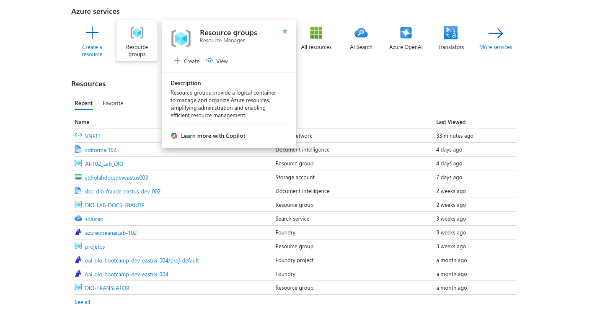
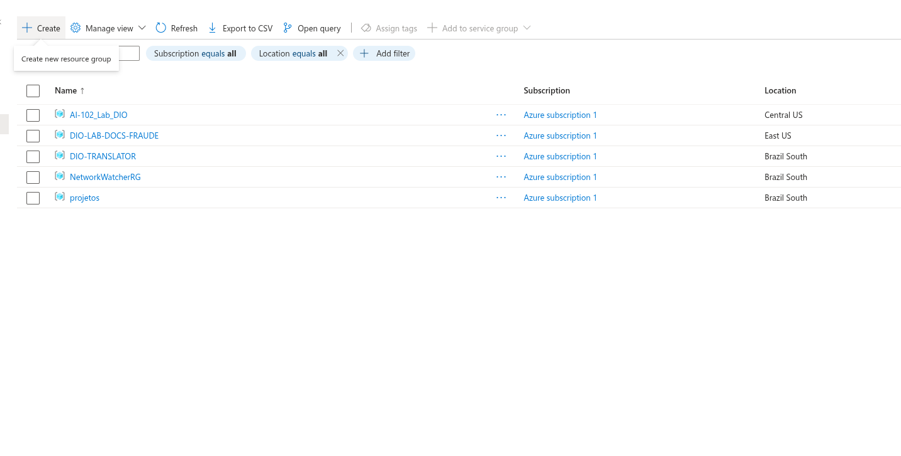
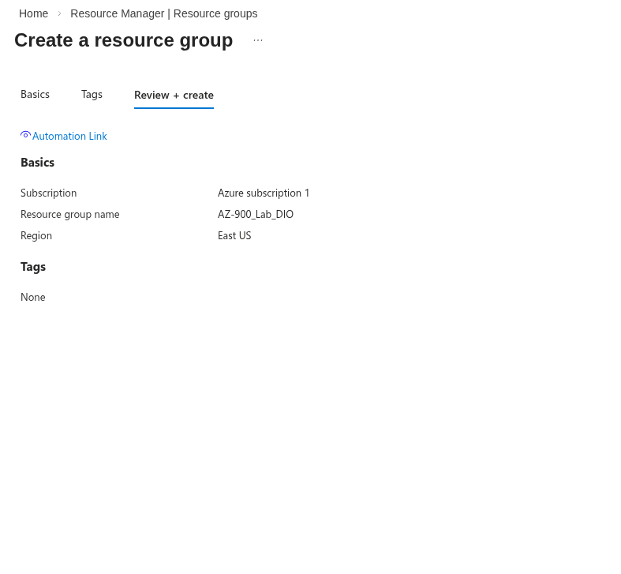
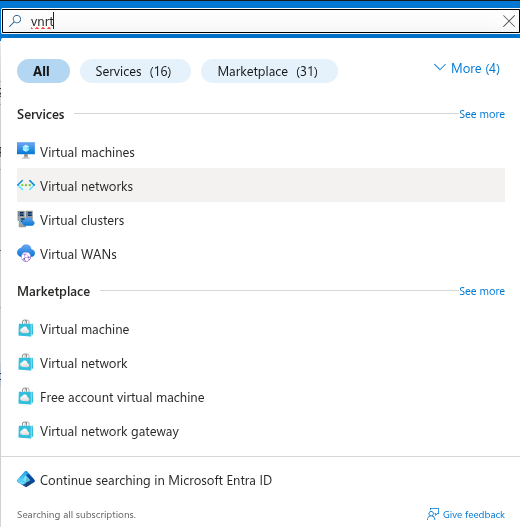
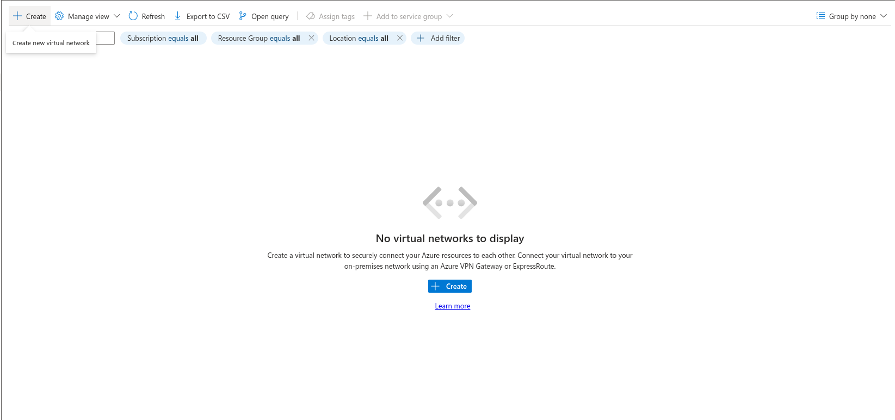
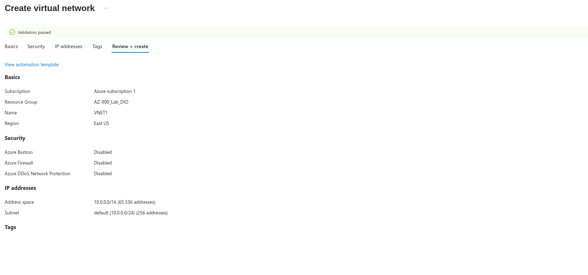
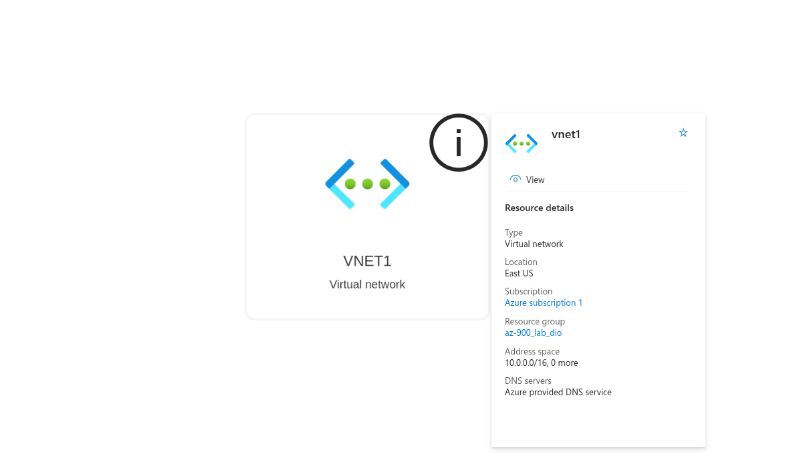

## Construindo Arquiteturas no Azure

- Criando um Group Resource (**AZ-900_Lab_DIO**)
- Implementando uma Virtual network (**VNET1**)
- *Portal Azure*

### Criando Group Resource
 
 
 

 ### Criando uma Virtual Network
 
 
 
 

